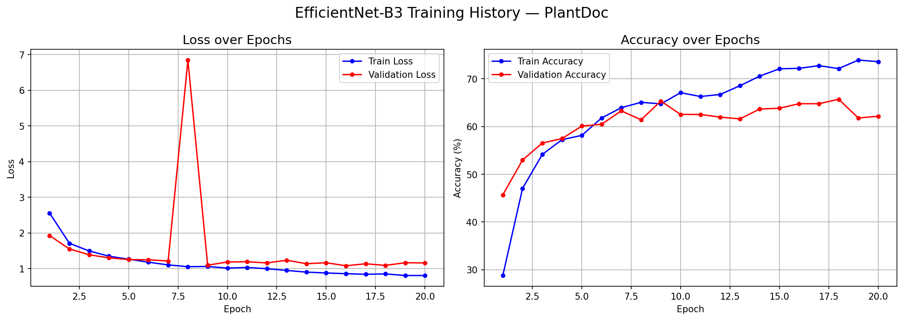
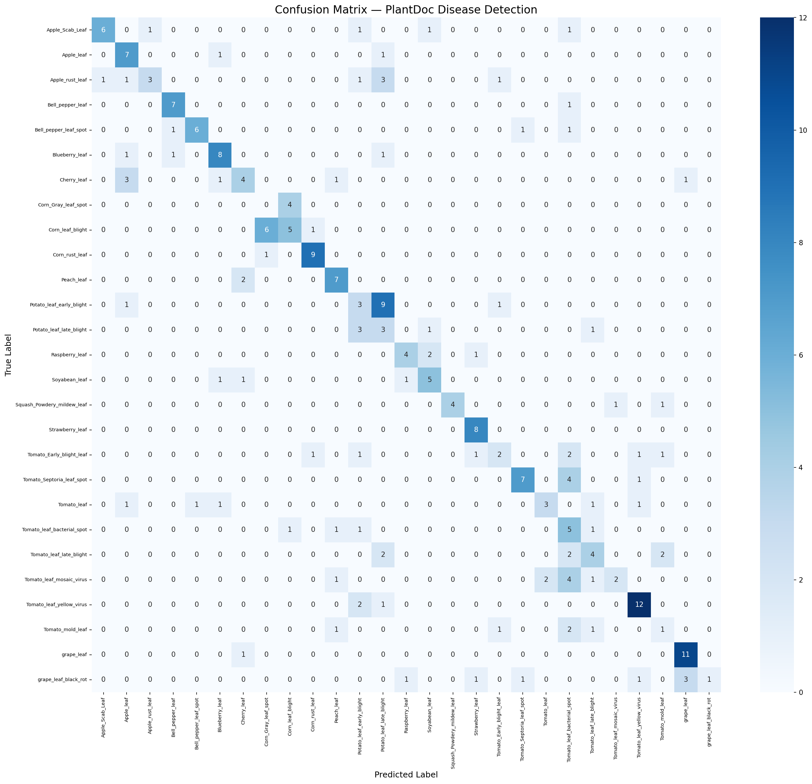

# 🌿 Crop Disease Detection using Deep Learning


> Real-world crop disease detection across 27 classes and 13 crop species using EfficientNet-B3 Transfer Learning — trained on the PlantDoc dataset which contains actual field images, not lab-controlled photos.

---

## 🚀 Live Demo
👉 **[Try it here](https://huggingface.co/spaces/YOUR_USERNAME/crop-disease-detection)**

Upload any plant leaf photo and get an instant disease diagnosis!

---

## 📌 Project Overview

Most plant disease detection projects use PlantVillage — a dataset with clean white backgrounds that fails completely on real farm images. This project uses **PlantDoc**, a dataset scraped from real agricultural fields, making the problem significantly harder and the solution significantly more useful.

---

## 🧠 Model Architecture

---

## 📊 Results

| Metric | Score |
|--------|-------|
| Best Validation Accuracy | 65.73% |
| Final Test Accuracy | 54.37% |
| Dataset | PlantDoc (real-world) |
| Classes | 27 diseases, 13 crops |
| Training Images | 2,134 |

> Note: PlantDoc is a challenging real-world dataset. Published research achieves 60-77% on this same dataset. Our result is within that range.

---

## 🌱 Supported Crops & Diseases

| Crop | Conditions |
|------|-----------|
| 🍎 Apple | Scab, Rust, Healthy |
| 🌽 Corn | Common Rust, Gray Leaf Spot, Healthy |
| 🍇 Grape | Black Rot, Healthy |
| 🥔 Potato | Early Blight, Late Blight, Healthy |
| 🍅 Tomato | Early Blight, Septoria Spot, Bacterial Spot, Mold |
| 🫑 Bell Pepper | Leaf Spot, Healthy |
| + more | Blueberry, Cherry, Peach, Raspberry, Soybean, Squash |

---

## 🛠️ Tech Stack

- **Model:** EfficientNet-B3 (Transfer Learning)
- **Framework:** PyTorch
- **Dataset:** PlantDoc
- **Augmentation:** RandomFlip, RandomRotation, ColorJitter, RandomResizedCrop
- **Deployment:** Gradio + Hugging Face Spaces

---

## ⚙️ Run Locally

```bash
# Clone the repo
git clone https://github.com/andreaajames/crop-disease-detection.git
cd crop-disease-detection

# Install dependencies
pip install -r requirements.txt

# Run the app
python app.py
```

---

## 📁 Project Structure
---

## 📈 Training Curves



---

## 🔢 Confusion Matrix



---

## 📚 References

- [PlantDoc Dataset](https://github.com/pratikkayal/PlantDoc-Dataset)
- [EfficientNet Paper](https://arxiv.org/abs/1905.11946)
- [PlantDoc Research Paper](https://dl.acm.org/doi/10.1145/3371158.3371196)
